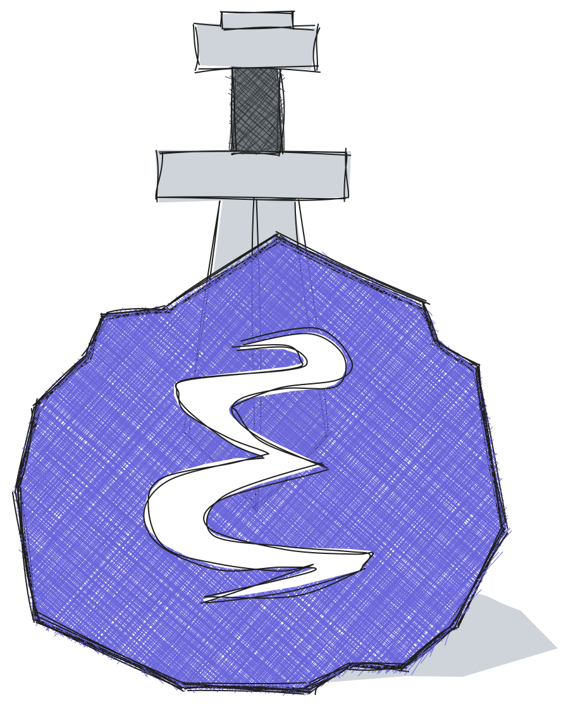

# Excalimacs



Excalidraw editing in Emacs buffers. New drawings are single `.excalidraw.png` files: Excalidraw's complete editable scene is embedded in the PNG metadata. Org, Markdown, and programming-mode templates keep a generated plain-text projection so tools such as ripgrep can find text in a drawing. No Node server runs while editing.

## Install with Elpaca

Tested with Emacs 30. The browser app is bundled, so Node.js is not needed to use Excalimacs:

```elisp
(use-package excalimacs
  :ensure (:host github :repo "Gleek/excalimacs"
           :files (:defaults "dist"))
  :custom
  (excalimacs-directory "~/path/to/drawings")
  :hook ((org-mode markdown-mode prog-mode agent-shell-mode)
         . excalimacs-minor-mode))
```

Elpaca installs the declared `simple-httpd` dependency. For a local checkout, add this directory to `load-path`, install `simple-httpd`, and configure Emacs:

```elisp
(require 'excalimacs)
(setq excalimacs-directory "~/path/to/drawings")
(add-hook 'org-mode-hook #'excalimacs-minor-mode)
```

Run `M-x excalimacs-create-drawing` in any buffer. It inserts a template at point and opens the browser editor. The first render creates its `.excalidraw.png`; later saves atomically replace that file and update searchable text in templates that include it. Org, Markdown, and programming modes include text. The agent-shell template is `@path`, which agent-shell sends as an image attachment when supported. A plain-text template covers other modes. Excalimacs finds the saved template again when a buffer reopens and does not edit submitted agent-shell history.

`excalimacs-minor-mode` controls display and deletion. With it enabled, a drawing template is shown as the PNG and protected from editing. In agent-shell it replaces only `@...excalidraw.png` mentions, leaving the shell prompt intact. Press `RET` or click the image to open it. Delete at its start or Backspace just after it removes the template; other keys retain their major-mode bindings. `excalimacs-delete-file` controls whether the PNG is also deleted: `ask` (default), `t`, or `nil`. Disable the minor mode to see and edit the full template as plain text. The creation command works with the minor mode off. Run `M-x excalimacs-open` to edit an existing PNG directly. Legacy `.excalidraw` files can still be opened.

Customize `excalimacs-templates` to add or override formats. An entry has a major-mode symbol and a property list. `:begin` must contain `{file}`; `:end` closes a multi-line template. Omit `:text` or set it to `t` to include searchable text, or set it to `nil` for a path-only template. For example:

```elisp
(add-to-list 'excalimacs-templates
             '(my-mode :begin "DRAW {file}" :end "END" :text t))
```

Use `:text-prefix` and `:text-suffix` to wrap each generated text line. Use `:comment t` to generate a template from a programming mode's `comment-start` and `comment-end`. Modes without a matching entry use the plain-text fallback.

If using `org-excalidraw`, disable its file watcher and old file opener while trying Excalimacs. They still launch the Excalidraw PWA and invoke excalirender.

Library items you create in Excalidraw are saved in `library.excalidrawlib`
under `user-emacs-directory/excalimacs/`. Libraries added from the Excalidraw
website are saved as separate `.excalidrawlib` files in that directory. You
can also copy library files there yourself. The open editor checks the directory
every two seconds, so removing a file removes its items from Excalidraw.
Set `excalimacs-library-directory` to use another directory.

## Element links

Select an element and use `Ctrl+K` / `Cmd+K` to attach or edit its link.
Enter a raw target such as `id:...`, `file:notes.org::Heading`,
`agent-shell:...`, `pdf:...`, or `https://example.com`. Clicking its link
opens it through Org's link resolver in Emacs, including custom registered
link types. Relative file paths are resolved from the drawing's directory.
The element's label is ordinary Excalidraw text and is edited separately.
You can also paste `[[target]]` or `[[target][description]]` into the link
field; Org opens the target and ignores the description. Normal Org link
confirmations still apply.
Templates with searchable text include element link targets as well as text
labels, including links attached to shapes and images. Raw targets are
exported as Org bracket links. Org templates use `#+begin_excalimacs` /
`#+end_excalimacs` with ordinary text inside, so Org recognizes the links
and org-roam can index links to its nodes. Disable the minor mode to follow
these links directly.

## Saving

Each browser view has a separate random token bound to one file. Edits autosave after a short pause; `Cmd+S` or `Ctrl+S` saves immediately. Emacs checks the file hash before replacing it and rejects stale saves.

After saving, the browser exports the same drawing revision to PNG with `exportEmbedScene` enabled and posts it to Emacs. Emacs accepts it only when the base hash matches the current file, updates matching Org blocks, and refreshes their images. A dot in the browser tab title means saving is unfinished. On a conflict, the editor offers an unsaved copy for download.

The Open menu action is disabled for Emacs-hosted sessions; open another drawing from Emacs. Live collaboration is not connected.

Use **Alt+Shift+O (Option+Shift+O on macOS)** or **Open in Excalidraw app** in the menu to save pending edits and open the same file using its system file association (`open` on macOS, `xdg-open` on Linux). Associate `.excalidraw` files with the Excalidraw app first. A save failure or conflict prevents opening. After saving changes in the external app, reload the wrapper to read them; it does not automatically follow external edits.

## Development

The committed `dist/` is the browser app served by Excalimacs. After changing `src/` or upgrading Excalidraw, rebuild and commit the updated `dist/` with the source changes:

```sh
npm ci
npm run build
```

Run the ERT tests from the repository root, with `simple-httpd.el` on the load path:

```sh
EMACSLOADPATH=/path/to/simple-httpd: emacs -Q --batch -L . -l excalimacs.el -l tests/excalimacs-test.el -f ert-run-tests-batch-and-exit
```

Or use the npm wrapper: `EMACSLOADPATH=/path/to/simple-httpd: npm test`.

These cover stale-save rejection, Unicode request handling, and Org link creation. Full browser-to-Emacs integration has been exercised manually.

Excalidraw uses upstream's `next` development channel, with an exact version pinned in `package.json` and `package-lock.json`. It exports the command palette directly, so no bundle patch is needed.

To upgrade to the latest published development build:

```sh
npm run upgrade:excalidraw
```

This installs and pins the newest `next` version and rebuilds the browser app (including fonts). It stops if a command fails; it does not roll back dependency changes. Save pending edits before upgrading, then refresh the browser afterward. No Emacs restart is needed.

Most upgrades should work without application changes, but development builds can change APIs or behavior. A passing build does not check every UI interaction: after upgrading, try editing text, saving, PNG previews, and the command palette. Upstream breaking changes may require application changes. The `next` channel is the latest published development build, which can lag behind the head of `master`.

## License

Excalimacs is licensed under [GPLv3](LICENSE). Excalidraw and the bundled fonts have their own licenses.
